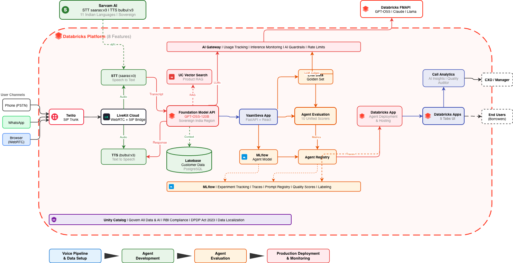

# InCred WhatsApp AI TeleSales Agent

WhatsApp AI agent for loan application completion — powered by Databricks.

## Architecture



## Features

- **Form-filling agent** — collects loan application fields step-by-step via WhatsApp
- **Lakebase (Postgres)** — real-time customer journey state with sub-200ms reads/writes
- **LLM (GPT-OSS-120B)** — handles customer questions, objections, multilingual (Hindi/English/Hinglish)
- **PDF upload** — bank statement collection via WhatsApp media
- **Twilio WhatsApp** — outbound nudges + inbound conversation (BSP-agnostic, works with Kaleyra)
- **Field validation** — PAN format, PIN code, date, income
- **Eligibility engine** — mock (production: calls InCred's API via MCP)
- **Conversation logging** — every turn stored in Lakebase

## Stack

| Component | Technology |
|-----------|-----------|
| Agent Runtime | Databricks App (FastAPI) |
| LLM | Databricks Foundation Model API (GPT-OSS-120B) |
| State Store | Databricks Lakebase (Postgres) |
| WhatsApp BSP | Twilio (swappable to Kaleyra) |
| Tracing | MLflow |
| Governance | Unity Catalog, AI Gateway |

## Setup

1. Deploy to Databricks App:
   ```bash
   databricks workspace import-dir . /Workspace/Users/<you>/incred-whatsapp-agent --overwrite
   databricks apps deploy <app-name> --source-code-path /Workspace/Users/<you>/incred-whatsapp-agent
   ```

2. Configure `app.yaml` with:
   - Lakebase project/branch/database
   - Twilio credentials (env vars)
   - LLM endpoint name

3. Set up Twilio WhatsApp sandbox webhook to `https://<app-url>/webhook/whatsapp`

4. Create Lakebase tables (see schema in `app.py`)

## License

Internal use — Databricks Field Engineering
